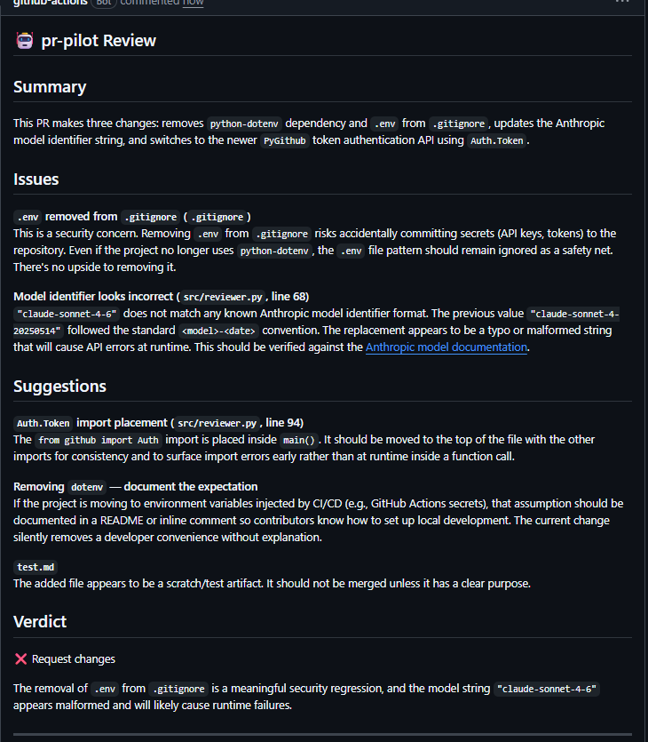

# 🤖 pr-pilot

> AI-powered pull request code reviewer using Claude (Anthropic API)

[](https://github.com/features/actions)
[](https://python.org)
[](https://anthropic.com)

pr-pilot automatically reviews your pull requests using Claude, posting structured feedback as a PR comment — no configuration needed beyond an API key.

---

## Example output



> pr-pilot reviewed its own development PR and caught a real issue: a `.gitignore` security regression and an import placement bug.

---

## Setup

### 1. Add your Anthropic API key as a secret

In your repo: **Settings → Secrets and variables → Actions → New repository secret**

| Name                  | Value                                                            |
| --------------------- | ---------------------------------------------------------------- |
| `ANTHROPIC_API_KEY` | Your key from[console.anthropic.com](https://console.anthropic.com) |

### 2. Add the workflow

Create `.github/workflows/pr-review.yml`:

```yaml
name: pr-pilot Review

on:
  pull_request:
    types: [opened, synchronize, reopened]

jobs:
  review:
    runs-on: ubuntu-latest
    permissions:
      pull-requests: write
      contents: read
    steps:
      - uses: actions/checkout@v4
      - uses: Mariana-Martins-R/pr-pilot@v1
        with:
          anthropic_api_key: ${{ secrets.ANTHROPIC_API_KEY }}
          github_token:      ${{ secrets.GITHUB_TOKEN }}
          review_style:      balanced   # strict | balanced | lenient
```

That's it — open a PR and pr-pilot will comment automatically.

---

## Review styles

| Style        | Behaviour                                                     |
| ------------ | ------------------------------------------------------------- |
| `strict`   | Flags everything — bugs, nits, style, refactor suggestions   |
| `balanced` | Highlights real bugs and meaningful improvements*(default)* |
| `lenient`  | Bugs and security issues only, encouraging tone               |

Set via the `review_style` input or the `REVIEW_STYLE` repository variable.

---

## Local development

```bash
git clone https://github.com/marianamartins/pr-pilot
cd pr-pilot
pip install anthropic PyGithub

export ANTHROPIC_API_KEY=sk-...
export GITHUB_TOKEN=ghp_...
export GITHUB_REPOSITORY=owner/repo
export PR_NUMBER=42
export REVIEW_STYLE=balanced

python src/reviewer.py
```

---

## Project structure

```
pr-pilot/
├── action.yml                        # Reusable GitHub Action definition
├── src/
│   └── reviewer.py                   # Core logic: fetch diff → call Claude → post comment
└── .github/
    └── workflows/
        └── pr-review.yml             # Workflow that triggers on PRs
```

---

## Tech stack

- **[Anthropic API](https://docs.anthropic.com)** — Claude for code review intelligence
- **[PyGithub](https://pygithub.readthedocs.io)** — GitHub API for fetching diffs and posting comments
- **[GitHub Actions](https://docs.github.com/en/actions)** — CI/CD trigger and runner

---

*Built by [Mariana Martins](https://linkedin.com/in/marianamartins-tech)*
